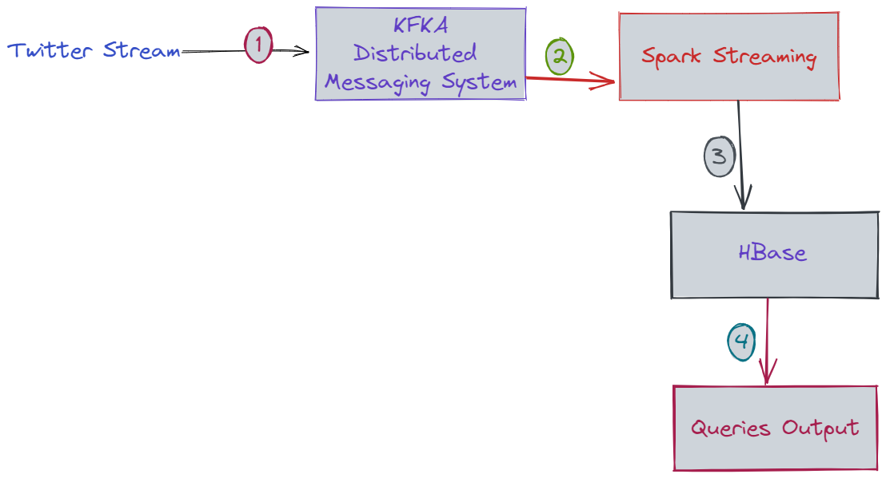

# Big Data Technology Project 
### Twitter-Kafka-Spark-HBase Integration

Fetch a stream of tweets from twitter, push it to Kafka, ingest the stream into Spark Stream and save it to HBase and bring up reports.

# Getting Started

### 1. Kakfa Installation 

1. Download and extract Kafka to your machine from https://downloads.apache.org/kafka/3.2.1/kafka_2.13-3.2.1.tgz
2. Extra it and locate it to your home directory, added the bin location to your system environment.
### 2. Runing Kafka
1. run kafka-topics.sh on linux Or kafka-topics.bat on windows to make sure that no existsing kafka
2. run ZooKeeper, after you run zookeeper you should get.  
   > **zookeeper-server-start.bat config/zookeeper.properties**
   > > **binding to port 0.0.0.0/0.0.0.0:2181**
3. run Kafka Server, after you run kafka-server you should get.
   > **kafka-server-start.bat config/server.properties**
   > > **Started socket server acceptors and processors**
### 3. Create Kafka Topic
Creating kafka topic where we receive our stream.
   > **.\kafka-topics.bat --create --topic=twitter-topic --bootstrap-server localhost:9092 --replication-factor=1 --partitions=1**
   >> Created topic twitter-topic.
   
To list current topics
   > **.\kafka-topics.bat --list --bootstrap-server localhost:9092**

### 4. Start Kafka Producer
Run Python Twitter Streamer (producer for Kafaka)
> **python producer.py**

### Libraries
kafka-python **[kafka-python](https://kafka-python.readthedocs.io/en/master/)** 

### Tools
Kafka **[Kafka](https://kafka.apache.org/quickstart)**
Workflow Drawing **[excalidraw](https://excalidraw.com/)**